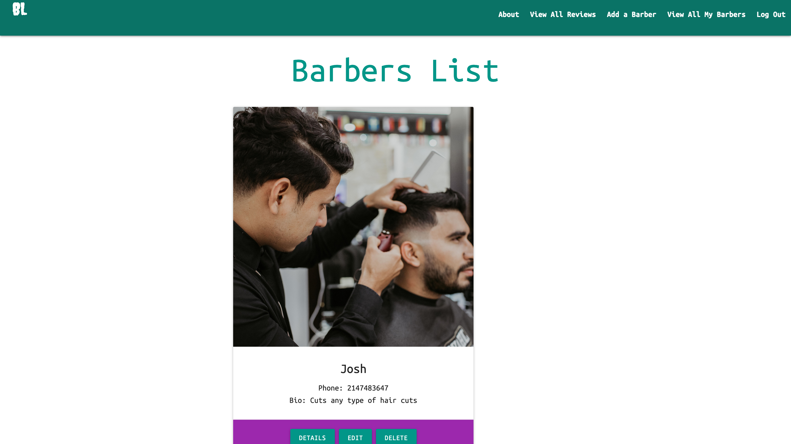

# BarberLink

## Screenshot

## Description

Welcome to BarberLink! Platform is designed to simplify your grooming experience by connecting you with premier barbers within your community. With BarberLink, you can easily find nearby barbers, book appointments through phone call, and share your experiences through reviews.
 
## Technology Used

- **Python** 
- **Django**
- **Postgresql**
- **Amazon S3**
- **HTML**
- **CSS** 
- **Materialize**

## Trello Board

You can check out the project planing [here](https://trello.com/invite/b/fpUD4lfC/ATTI0c516530cdcd70e2a6574e2f31349c57F68B7271/project-3).

## Live Link

You can check out the live version of the application [here](https://barberlink-d6788205aff5.herokuapp.com/).

